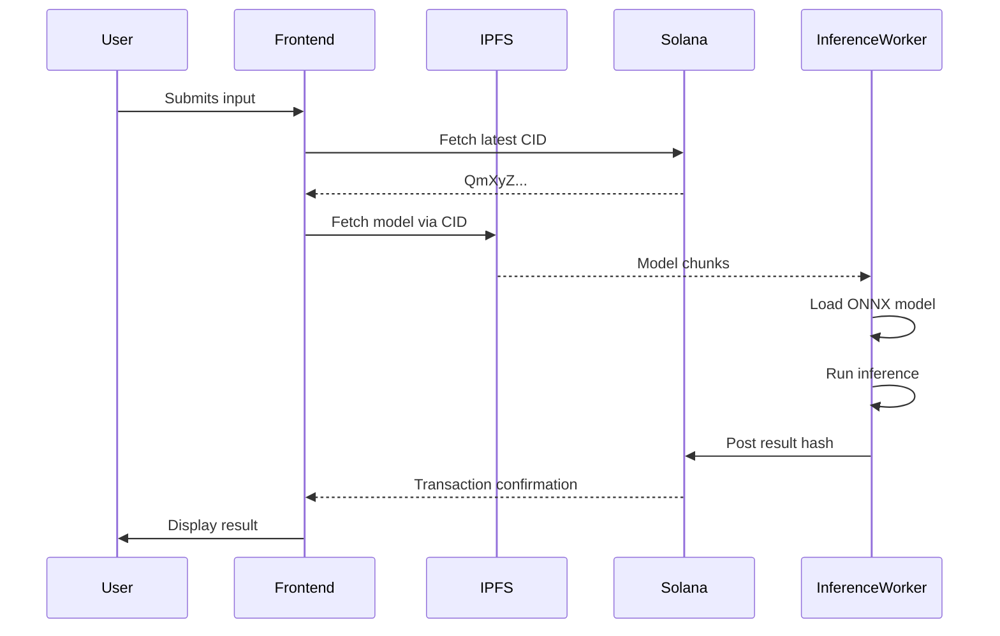
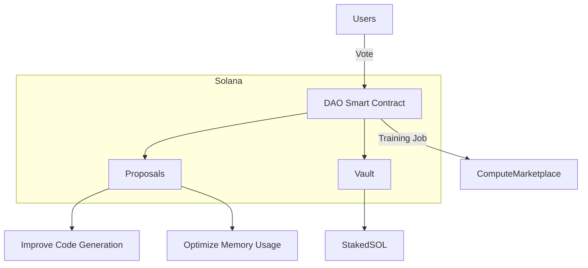
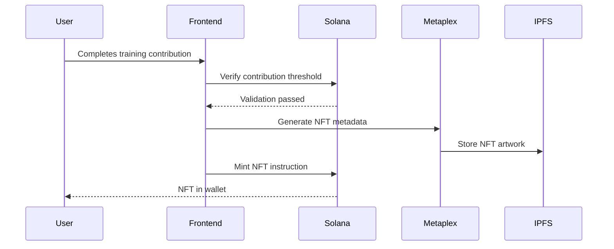

---

### **1. Real Model Integration with IPFS/Arneave**

#### **Technical Flow**


#### **Code Implementation**

**a. Model Loader with Progressive Loading**
```javascript
// src/utils/modelLoader.js
import { create } from 'ipfs-http-client';
import { AutoModel, AutoTokenizer } from '@huggingface/transformers';

const IPFS_GATEWAY = 'https://cloudflare-ipfs.com/ipfs/';

export async function loadDecentralizedModel(cid) {
  const ipfs = create({ url: 'https://ipfs.infura.io:5001' });
  
  // Progressive loading for large models
  const chunks = [];
  for await (const chunk of ipfs.cat(cid)) {
    chunks.push(chunk);
    updateLoadingProgress(chunks.length); // UI progress bar
  }
  
  const modelBuffer = Buffer.concat(chunks);
  return {
    model: await AutoModel.fromBuffer(modelBuffer),
    tokenizer: await AutoTokenizer.fromBuffer(modelBuffer)
  };
}
```

**b. Solana Program for CID Management**
```rust
// programs/model-manager/src/lib.rs
use anchor_lang::prelude::*;

#[account]
#[derive(Default)]
pub struct ModelRegistry {
    pub current_cid: String,      // "QmXyZ..."
    pub version: u64,             // Model version
    pub owner: Pubkey,            // DAO address
    pub training_data_cid: String // Training dataset reference
}

#[derive(Accounts)]
pub struct UpdateModel<'info> {
    #[account(mut, has_one = owner)]
    pub model_registry: Account<'info, ModelRegistry>,
    #[account(signer)]
    pub owner: AccountInfo<'info>, // DAO governed
    // ... other constraints
}
```

---

### **2. Training Governance DAO**

#### **Architecture**


#### **Implementation**

**a. DAO Program**
```rust
// programs/dao/src/lib.rs
#[account]
pub struct Proposal {
    pub description: String,       // "Improve code generation"
    pub votes_for: u64,            // Token-weighted votes
    pub votes_against: u64,
    pub executed: bool,            // Training job triggered
    pub target_param: String,      // "code_generation"
    pub training_budget: u64       // SOL allocated
}

#[derive(Accounts)]
pub struct CreateProposal<'info> {
    #[account(init, payer = authority)]
    pub proposal: Account<'info, Proposal>,
    pub model_registry: Account<'info, ModelRegistry>,
    #[account(mut)]
    pub authority: Signer<'info>,
    // ... other constraints
}
```

**b. Frontend Voting Interface**
```jsx
// src/components/DAOVoting.jsx
import { useConnection, useWallet } from '@solana/wallet-adapter-react';

export default function DAOVoting({ proposals }) {
  const { publicKey, sendTransaction } = useWallet();

  const castVote = async (proposalId, isFor) => {
    const instruction = createVoteInstruction({
      voter: publicKey,
      proposal: proposalId,
      modelRegistry: MODEL_REGISTRY_ID,
      systemProgram: SystemProgram.programId,
    }, { isFor });

    await sendTransaction(new Transaction().add(instruction));
  };

  return (
    <div className="dao-glass-panel">
      {proposals.map((prop) => (
        <div key={prop.id} className="proposal-card">
          <h3>{prop.description}</h3>
          <div className="vote-meter">
            <div 
              className="for-bar" 
              style={{ width: `${(prop.votesFor/(prop.votesFor+prop.votesAgainst))*100}%` }}
            />
          </div>
          <button onClick={() => castVote(prop.id, true)}>✓ For</button>
          <button onClick={() => castVote(prop.id, false)}>✗ Against</button>
        </div>
      ))}
    </div>
  );
}
```

---

### **3. Compute Marketplace Integration**

#### **Decentralized Compute Flow**
```javascript
// src/utils/computeMarketplace.js
export async function requestTrainingJob(cid, params) {
  // Query multiple compute networks
  const [akashOffers, golemOffers] = await Promise.all([
    fetchAkashMarketplace(params),
    fetchGolemMarketplace(params)
  ]);

  // Select best offer (example: lowest price)
  const bestOffer = [...akashOffers, ...golemOffers]
    .sort((a, b) => a.price - b.price)[0];

  // Initiate training job
  const jobId = await startTrainingJob({
    provider: bestOffer.providerId,
    modelCid: cid,
    trainingParams: params
  });

  // Store job ID on Solana
  await recordTrainingJobOnChain(jobId, bestOffer);
  return jobId;
}

// Example Akash query
async function fetchAkashMarketplace(params) {
  const response = await fetch('https://api.akash.network/marketplace', {
    method: 'POST',
    body: JSON.stringify({
      gpuType: 'A100',
      ramMin: '32GB',
      duration: params.estimatedTime
    })
  });
  return response.json().offers;
}
```

---

### **4. Achievement NFTs System**

#### **NFT Minting Workflow**


#### **Implementation**

**a. NFT Minting Program**
```rust
// programs/nft-minter/src/lib.rs
use metaplex_token_metadata::instruction::create_mint_instruction;

#[derive(Accounts)]
pub struct MintAchievement<'info> {
    #[account(mut)]
    pub payer: Signer<'info>,
    /// CHECK: New NFT mint
    pub mint: UncheckedAccount<'info>,
    pub metadata: UncheckedAccount<'info>,
    pub token_program: Program<'info, Token>,
    pub system_program: Program<'info, System>,
    // ... other accounts
}

pub fn mint_achievement(ctx: Context<MintAchievement>, achievement_type: String) -> Result<()> {
    let achievement = match achievement_type.as_str() {
        "contributor" => AchievementData::new("Top 10% Contributor", "ipfs://Qm..."),
        // ... other types
    };

    // Metaplex metadata instructions
    create_mint_instruction(
        &ctx.accounts.metadata,
        // ... params
    )?;

    Ok(())
}
```

**b. NFT Gallery Component**
```jsx
// src/components/NFTGallery.jsx
import { useWallet } from '@solana/wallet-adapter-react';

export default function NFTGallery() {
  const { publicKey } = useWallet();
  const [nfts, setNfts] = useState([]);

  useEffect(() => {
    if (publicKey) {
      fetch(`https://api.solscan.io/account/${publicKey}/nft`)
        .then(res => res.json())
        .then(data => setNfts(data.filter(n => n.collection === 'AI_ACHIEVEMENTS')));
    }
  }, [publicKey]);

  return (
    <div className="nft-grid">
      {nfts.map(nft => (
        <div key={nft.mint} className="nft-card">
          
          <h4>{nft.name}</h4>
          <p>{nft.description}</p>
          <div className="badge">AI Contributor #{nft.attributes.rank}</div>
        </div>
      ))}
    </div>
  );
}
```

---

### **Cross-Feature Synergy**

1. **Achievement Unlocking Logic**
```javascript
// src/utils/achievements.js
export function checkAchievements(contributions) {
  const thresholds = {
    bronze: { tasks: 10, solStaked: 5 },
    silver: { tasks: 50, solStaked: 25 },
    gold: { tasks: 100, solStaked: 100 }
  };

  return Object.entries(thresholds).map(([tier, req]) => ({
    unlocked: contributions.tasks >= req.tasks && 
              contributions.solStaked >= req.solStaked,
    tier
  }));
}
```

2. **On-Chain Proof of Compute**
```rust
// programs/compute-verifier/src/lib.rs
pub struct TrainingJobRecord {
    pub provider: Pubkey,      // Compute provider ID
    pub model_cid: String,     // Model version trained
    pub accuracy_gain: f32,    // Validation metrics
    pub energy_used: f32,      // kWh for sustainability report
    pub reward_distributed: u64 // SOL paid to provider
}
```

---

### **Challenges & Solutions**

| **Challenge** | **Solution** | **Tools** |
|---------------|--------------|-----------|
| Model Loading Performance | IPFS + Service Worker Caching | Workbox, IPFS Pinning Services |
| Training Verifiability | Zero-Knowledge Proofs of Training | zkSNARKs Circuit (Circom) |
| Decentralized GPU Coordination | Standardized Compute Units | Akash ML Marketplace API |
| NFT Metadata Management | Decentralized Metadata Standards | Metaplex Digital Asset Standard |

---

### **Emerging Patterns**

1. **Hybrid Compute Architecture**
   - On-Chain: Coordination, Payments, Governance
   - Off-Chain: Model Storage (IPFS), Compute (Akash/Golem), Verification (ZK Proofs)

2. **Token-Incentivized Training**
   - Contributors earn:
     - SOL for compute resources
     - DAO Tokens for governance participation
     - NFTs for reputation building

3. **Sustainable AI Tracking**
   - On-chain records of:
     ```json
     {
       "energy_used": 42.5,
       "co2_offset": 2.1,
       "hardware_efficiency": 0.92
     }
     ```

This architecture creates a complete decentralized AI ecosystem powered by Solana, combining cutting-edge Web3 patterns with practical machine learning operations. Each component can be incrementally implemented while maintaining user engagement through the futuristic interface.
