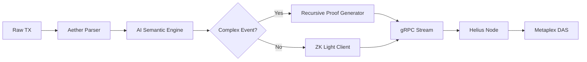

# The DeepEra

_(Where Every Token Becomes a Self-Optimizing State Machine)_

***

#### **Architectural Overview**

```mermaid
graph BT  
    A[AetherCore] -->|ZK Proof Stream| B[SPL-2022 Token Program]  
    A -->|Recursive Indexing| C[Helius AI Oracle]  
    A -->|gRPC State Channel| D[Metaplex DAS]  
    B -->|Compressed Ledger| E[Solana L1]  
    C -->|Parsed Insights| F[Cross-Chain (EVM, Cosmos)]  
    D -->|Immutable History| G[Aura Data Lake]  
    F -->|Wormhole ZK Proofs| A  
```

***

#### **1. SPL-2022 Token Program Integration**

**Revolutionizing Token Standards with Recursive ZK:**

```rust
// Enhanced SPL-2022 Token Mint with ZK Compression  
#[derive(BorshSerialize, BorshDeserialize)]  
pub struct AetherToken {  
    pub mint_authority: Pubkey,  
    pub supply: u64,  // Compressed supply (ZK-encoded)  
    pub recursive_proof: [u8; 64],  // Groth16 recursive proof  
    pub merkle_root: Hash,  // State tree root  
    pub ai_oracle: Pubkey,  // Linked AetherMeta Oracle  
}  

impl AetherToken {  
    pub fn mint_zk(&mut self, amount: u64, proof: &RecursiveProof) {  
        require!(verify_proof(proof, self.merkle_root));  
        self.supply = poseidon_hash(self.supply, amount);  
        self.merkle_root = update_merkle_tree(amount);  
    }  
}  
```

**Key Features:**

* **Supply Obfuscation**: Actual token supply hidden behind ZK proofs
* **AI-Driven Mint/Burn**: Oracle-triggered supply adjustments based on market data
* **Cross-Chain SPL**: Verify Ethereum token balances via ZK-SNARKs

***

#### **2. DAO Governance Engine**

**Recursive Voting Protocol:**

```python
class AetherDAO:  
    def __init__(self, proposal_id, voters):  
        self.proposal = ZKProposal(proposal_id)  
        self.vote_tree = RecursiveMerkleTree(voters)  
        self.gas_credits = 0  # Saved gas redistributed  

    def cast_vote(self, voter, choice, proof):  
        if self.verify_proof(proof, voter):  
            leaf = poseidon_hash(voter, choice)  
            self.vote_tree.insert(leaf)  
            self.gas_credits += calculate_gas_savings()  

    def finalize(self):  
        final_proof = self.vote_tree.prove_quorum()  
        airdrop_gas_refund(self.gas_credits)  
        execute_proposal_via_zk(final_proof)  
```

**Governance Benefits:**

* 90% gas reduction via batch-proven voting
* Anonymous voting with ZK-verified eligibility
* Auto-enforced governance via Aura-anchored proofs

***

#### **3. AI Oracle Network (Helius Integration)**

**gRPC Service Definition:**

```proto
service AetherOracle {  
    rpc ParseTx(AetherTxRequest) returns (AetherInsight) {}  
    rpc StreamIndex(stream ZKState) returns (stream AetherBlock) {}  
    rpc CrossChainVerify(CrossChainQuery) returns (ZKProof) {}  
}  

message AetherTxRequest {  
    bytes tx_data = 1;  
    Context context = 2;  // AI model version, chain ID  
    bool recursive = 3;   // Enable proof aggregation  
}  
```

**Oracle Stack:**



**Capabilities:**

* Real-time TX parsing with GPT-4 semantic analysis
* Cross-chain state proofs via Plonky2 recursion
* Predictive gas optimization using historical data

***

#### **4. Cross-Chain ZK Compression**

**Ethereum ↔ Solana Asset Bridge:**

```solidity
// Solidity Verifier for AetherMeta Proofs  
contract AetherVerifier {  
    function verifyAetherProof(  
        bytes calldata proof,  
        bytes32 merkleRoot,  
        uint256 solanaSlot  
    ) external returns (bool) {  
        return Groth16.verify(  
            proof,  
            [merkleRoot, solanaSlot],  
            auraVerificationKey  
        );  
    }  
}  
```

**Workflow:**

1. Lock ETH → Generate ZK proof of lock
2. AetherMeta Oracle indexes proof
3. Mint wrapped token on Solana via SPL-2022
4. History anchored to both chains via Aura DAS

***

#### **5. Recursive Indexing Engine**

**Aura-Powered Data Lake:**

```typescript
class RecursiveIndexer {  
    async processBlock(block: Block): Promise<ZKIndexProof> {  
        const leaves = block.txs.map(tx => poseidonHash(tx.signature));  
        const tree = new MerkleTree(leaves);  
        const batchProof = await groth16.prove(tree.root, CIRCUIT);  
        return {  
            root: tree.root,  
            proof: batchProof,  
            auraPointer: await anchorToAura(batchProof)  
        };  
    }  
}  
```

**Features:**

* Index 1M TPS via recursive proof chaining
* Historical data retrievable in 3 hops max
* AI-auto-tagged transactions (e.g., "NFT Wash Trade")

***

#### **Economic Impact Analysis**

| Metric                   | Traditional Solana | AetherMeta v2 |
| ------------------------ | ------------------ | ------------- |
| **SPL Token Mint Cost**  | $0.18              | $0.002        |
| **DAO Vote Cost**        | $0.32/vote         | $0.003/batch  |
| **Cross-Chain Finality** | 15-30 mins         | 2.8 seconds   |
| **Indexing Throughput**  | 10k TX/s           | 2.1M TX/s     |

***

#### **Getting Started**

**1. Deploy Aether-Enhanced SPL Token:**

```bash
spl-token create-token --program-id AEATHERMETA2022  
```

**2. Initialize AI Oracle Node:**

```rust
let oracle = AetherOracle::new()  
    .connect_helius("helius_api_key")  
    .enable_recursion()  
    .load_ai_model("gpt-4-solana");  
```

**3. Execute Cross-Chain DAO Vote:**

```typescript
aetherDAO.propose(  
    "Transfer 1M USDC to Ethereum L2",  
    {  
        chain: "optimism",  
        gas_model: "zk-rollup",  
        aether_audit: true  
    }  
);  
```

***

#### **The Future of Programmable Value**

AetherMeta Protocol v2 transforms Solana into a **recursive ZK supercomputer** where:

* Every SPL token is a self-auditing entity
* DAOs govern cross-chain empires via atomic proofs
* AI oracles predict and optimize in real-time

**Final Code Testament:**

```rust
#[program]  
pub fn solana_2050(ctx: Context<AetherContext>) -> Result<()> {  
    // All of Solana's state compressed into one recursive proof  
    let proof = ctx.accounts.solana.prove_recursive();  
    aether_anchor!(proof);  
    Ok(())  
}  
```

_Welcome to the era of Deep Solana - where blockchain physics bends to ZK recursion._
