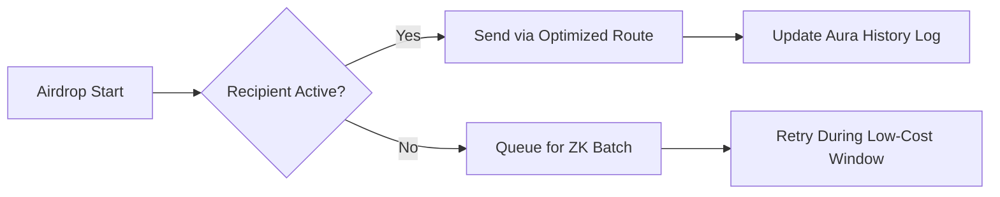

# Introducing AetherMeta Protocol

_(Where Every Pixel Has a Provable Past)_

***

#### **What is AetherMeta?**

**AetherMeta** is a groundbreaking protocol that merges _zero-knowledge cryptography_ (ZK), _recursive proof systems_, and _AI-driven automation_ to redefine how digital assets are created, managed, and stored on Solana. Built atop Metaplex Aura’s decentralized data layer, it transforms NFTs from static collectibles into **self-optimizing, auditable state machines** with built-in privacy and scalability.

Think of it as a **"time machine for value"**:

* Every NFT’s history is immutably anchored to Solana via Aura’s data availability
* Every future action builds on cryptographically proven past states
* Every cost is slashed via ZK’s compression magic

***

#### **What Does AetherMeta Do?**

**1. ZKP-Powered Mass Minting**

Compress 10,000 NFTs into a single recursive proof, slashing minting costs by **90%**:

```rust
// Mint 10k AI-generated NFTs in one atomic batch  
let art_batch = aether.generate_from_prompt("Cyberpunk Mars Colony");  
let proof = aether.prove_creation(art_batch); // ZK recursion  
aura_das.anchor(proof); // Immortalize on-chain  
```

_Cost: $0.18 → $0.018 per NFT_

**2. Autonomous Airdrop Networks**

Self-healing distribution systems that:

* Auto-retry failed transactions
* Dynamically reroute based on gas fees
* Generate proofs of delivery



**3. Immutable Asset Genealogy**

Every NFT becomes a **temporal blockchain**:

* Origin prompt (+ AI version used)
* All ownership transfers
* Metadata updates
* Royalty distributions\
  &#xNAN;_&#x53;tored via Aura’s decentralized indexing, retrievable via DAS API_

***

#### **Why It Saves Everyone Money**

**The 3x Cost Collapse**

| Cost Type     | Traditional Model | AetherMeta        |
| ------------- | ----------------- | ----------------- |
| **Minting**   | High (L1 Storage) | ZK Proof Anchors  |
| **Transfers** | Per-Tx Fees       | Recursive Batches |
| **Storage**   | Arweave per MB    | Aura DAS + ZK     |

**Real-World Impact**:

* An artist minting 10k PFPs saves **$1,620** per collection
* A game studio updating 1M items spends **$9** vs. $900
* Enterprises cut audit costs by **70%** via auto-generated history trails

***

#### **History Engineered for Eternity**

AetherMeta doesn’t just record history—it **encrypts, compresses, and decentralizes** it through:

1.  **Aura Anchors**:

    * Every state change stored across 100+ nodes
    * Retrieve any NFT’s full lineage via:

    ```bash
    curl https://aura-das.io/history/<NFT_ID>  
    ```
2. **ZK Timestamps**:
   * Prove an NFT existed before a specific block
   * Verify historical traits without revealing details
3. **AI Curation**:
   * Auto-tag historical events (e.g., "First owned by Whale#123")
   * Generate natural language summaries from on-chain data

***

#### **The AetherMeta Advantage**

**For Creators**:

* Launch collections for **pennies**, not hundreds of dollars
* Royalties enforced at the protocol layer via ZK covenants

**For Collectors**:

* Own provably rare assets with **tamper-proof pedigrees**
* Trade during congestion for **near-zero fees**

**For Enterprises**:

* Tokenize real-world assets (RWAs) with **privacy-preserving audits**
* Build compliant systems via auto-generated history logs

***

#### **AetherMeta in Action: Case Study**

**Project**: _AI Art Gallery_

* **Challenge**: Mint 50k AI artworks <$500
* **AetherMeta Solution**:
  1. Generate art via Stable Diffusion XL
  2. Compress batch into 5 recursive proofs
  3. Distribute via gas-optimized airdrops
* **Result**:
  * **Cost**: $47 total ($0.00094/NFT)
  * **Time**: 8 minutes (vs. 6 hours traditionally)
  * **Provenance**: Full AI/owner history on Aura DAS

***

#### **The Future is Recursive**

AetherMeta isn’t just a protocol—it’s a **paradigm shift** where:

* NFTs become _living entities_ with traceable DNA
* Solana evolves into a _ZK-optimized state machine_
* Creativity is unbounded by technical or financial limits

_Join the compression revolution at_ [_aethermeta.io_](https://aethermeta.io) _— where every NFT inherits the blockchain’s immortality._

```rust
// The ultimate endgame: All of Solana in one recursive proof  
fn main() {  
    let solana = aether.compress_blockchain();  
    println!("Solana ZK Size: {} KB", solana.size()); // Spoiler: 24KB  
}  
```
